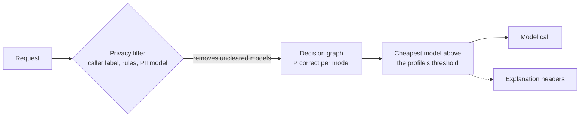

# EcoRoute

**Privacy-constrained, explainable cost routing for enterprise LLM traffic.**

Companies send most LLM requests to their most capable model, even though many of those
requests would be answered just as well by a model that costs a fraction as much. Many
companies also cannot let confidential data reach external providers. EcoRoute is an
OpenAI-compatible gateway that solves both, request by request:

1. A privacy filter removes every model that isn't cleared for the data.
2. A decision graph predicts which of the remaining models will answer correctly.
3. The cheapest model predicted to succeed is chosen, and the reason is stated.

Apps keep their OpenAI client and change only `base_url` and `model="ecoroute/auto"`.

## Impact at a glance

| | |
|---|---|
| **70% lower LLM cost** | than always using GPT-4o at the same accuracy (default profile: 0.3 points lower, inside its 1-point target, 90% CI) |
| **About $540k a year** | saved at 10M requests a month, estimated from that measured rate ([impact.md](docs/impact.md)) |
| **99% of restricted data kept in-house** | keys, account and ID numbers and cards never reach an external model |
| **97% of personal data caught** | names, addresses, emails and phones, with 7.6% false alarms on ordinary prompts |
| **74 ms per decision** | privacy check, prediction and explanation on one T4 GPU, small next to the LLM call |
| **Every decision explained** | which models were cleared, which are likely to succeed, and why this one was chosen |
| **Drop-in** | OpenAI-compatible; sits behind existing API gateways, LLM proxies and DLP labels |


## Documentation

| Document | For |
|---|---|
| [Technical report](docs/report.md) | Method, datasets, evaluation protocol, results with confidence intervals, ablations, limitations |
| [Enterprise integration](docs/enterprise-integration.md) | Where it sits in a company's stack, compliance, deployment, observability, rollout |
| [Impact estimates](docs/impact.md) | Cost, energy and CO2 at company volumes, with every assumption stated |
| [How it decides](docs/how-it-decides.md) | The decision path step by step |

## How it works



1. **Privacy filter (hard rule).** The prompt and the whole conversation are classified as
   public, internal, confidential or restricted. The classification combines the caller's
   DLP label, deterministic rules and a PII model
   ([piiranha](https://huggingface.co/iiiorg/piiranha-v1-detect-personal-information)).
   - The rules cover secrets, cards (Luhn), IBANs, SSNs, labelled and long ID numbers,
     emails and phones.
   - Models whose `clearance` is below the level are removed, and nothing can override
     this.
2. **Decision graph.** The prompt is linked to skills (code, math, chat, ...), to a
   difficulty level and to the most similar past prompts. Each path ends at a model with
   the share of such prompts that model answered correctly. The result is a calibrated
   P(correct) for every model, plus the heaviest paths that explain it.
3. **Cost and energy.** Among the cleared models at or above the profile's threshold,
   EcoRoute takes the one with the lowest `cost + lambda * energy`. If none reaches the
   threshold, it takes the most likely model, or the cheapest one within a small, tested
   margin of it.

Every response carries the decision in its headers: `X-EcoRoute-Model`, `-Level`,
`-Difficulty`, `-Reason` and `-Time-Ms`.

## Results

These results are for router v14 on held-out SPROUT test prompts, against always using
GPT-4o (accuracy 0.845). Thresholds are chosen on validation prompts the router never
trained or calibrated on, with a 95% one-sided margin. Every 90% interval stays inside
its profile's target.

| Profile  | Accuracy target       | Points lost vs GPT-4o (90% CI)   | Cost saved |
|----------|-----------------------|----------------------------------|------------|
| quality  | no loss               | -1.6 (-2.2 to -0.9), i.e. better | 34%        |
| balanced | at most 1 point lost  | 0.3 (-0.4 to 1.0)                | 70%        |
| eco      | at most 3 points lost | 1.6 (0.8 to 2.3)                 | 75%        |

- **Privacy filter**, measured on 2,000 texts with personal data and 2,000 ordinary
  prompts:
  - 99.0% of texts with restricted data and 96.7% of texts with any personal data are
    kept off external models;
  - false alarms are 7.6%.
- **Coding prompts (BigCodeBench):** 48% to 60% cheaper than GPT-4o, at 1.8 points lower
  accuracy.
- **End to end:** `scripts/e2e_check.py` passes all 16 checks through the real HTTP
  gateway: privacy, refusals, profiles and streaming.
- **Ablations:** the [report](docs/report.md#42-ablations) covers each design choice and
  what it changed, including a leak in an earlier evaluation protocol that was found and
  fixed.

## Quick start

```bash
pip install -e ".[dev]"
pytest
```

You need a trained router file (`router.pt`); see [Train a router](#train-a-router).
Encoder and PII models are downloaded from Hugging Face on first use.

**See decisions without calling any model:**

```bash
python scripts/route_demo.py --router artifacts/router.pt
```

**Run the gateway as a dry run** (no API keys, no cost; each answer names the model that
would have been used):

```bash
python scripts/serve.py --router artifacts/router.pt --dry-run
python scripts/e2e_check.py --router artifacts/router.pt   # end-to-end checks, PASS/FAIL
```

**Run it for real:**

```bash
export ANTHROPIC_API_KEY=... OPENAI_API_KEY=... GEMINI_API_KEY=...   # only those you use
python scripts/serve.py --router artifacts/router.pt --port 8080 --pii-device 0
```

```python
from openai import OpenAI

client = OpenAI(base_url="http://localhost:8080/v1", api_key="unused")
r = client.chat.completions.with_raw_response.create(
    model="ecoroute/auto",
    messages=[{"role": "user", "content": "Summarise this ..."}],
    extra_headers={"X-EcoRoute-Policy": "balanced"},  # eco / balanced / quality
)
r.headers["X-EcoRoute-Model"], r.headers["X-EcoRoute-Reason"]
```

- **Routable models:** only models with a confirmed `api_id` in `configs/models.yaml` and
  their provider's API key set. Local models go through Ollama or vLLM; see
  `configs/providers.yaml`.
- **Request headers:** `X-EcoRoute-Sensitivity` passes your own data label (e.g.
  `Confidential`), and `X-EcoRoute-Min-Level` sets a minimum level.
- **Naming a model:** asking for a specific model instead of `ecoroute/auto` skips the
  ranking but never the privacy check. An uncleared model gets a 403.
- **Explanation only:** `POST /route` returns the decision and explanation without
  calling any model.
- **Provider failures:** if the chosen provider fails, the gateway retries on the most
  likely other cleared model.
- **CPU only:** add `--no-pii-model` to keep only the rules.

## Train a router

The training data is free and open, and no paid grading is needed.

- **[SPROUT](https://huggingface.co/datasets/CARROT-LLM-Routing/SPROUT):** about 44k
  prompts graded on 13 models.
- **[RouterArena](https://huggingface.co/datasets/RouteWorks/RouterArena):** difficulty
  labels.
- **[BigCodeBench](https://huggingface.co/datasets/bigcode/bigcodebench):** 1,140 Python
  tasks graded on 11 of the same models.
- **[RouterBench](https://huggingface.co/datasets/withmartian/routerbench):** used for the
  baseline comparisons.

```bash
python scripts/build_dataset.py --out data/processed          # about 2 GB download
python scripts/train_router.py --data data/processed --out artifacts/router.pt
python scripts/check_routing.py --router artifacts/router.pt --data data/processed
```

`train_router.py` does four things:

- It fits the decision graph on the train split.
- It calibrates it on half of validation.
- On the other half, it chooses each profile's threshold and fallback margin.
- It prints test results with 90% intervals and the coding-prompt breakdown.

The router file stores the predictor, the encoder name, the thresholds and the margins.
`--predictor ensemble` trains the kNN, matrix factorization, IRT and MLP ensemble instead,
for comparison.

The catalog in `configs/models.yaml` holds prices, energy, clearance and an `anchor` for
each model. The anchor is a graded model of a similar tier plus a logit shift, so you can
add a new model without retraining. Fit the shift from a few hundred graded answers with
`CatalogPredictor.fit_shift()`.

### On Lightning AI (free GPU tier)

```bash
pip install lightning-sdk
export LIGHTNING_USER_ID=... LIGHTNING_API_KEY=...
python scripts/lightning_run.py --teamspace <your-teamspace> --machine T4 --pytest
```

This ships the current commit to a Studio, builds the data, trains, downloads the reports
to `reports/lightning/` and always stops the Studio at the end. It refuses to start below
`--min-credits` (default 3) and stops after `--max-hours` (default 2). Inside a Studio you
can also run the commands above directly.

## Measuring

| Script | What it measures |
|---|---|
| `scripts/train_router.py` | Routing accuracy and cost per profile, with intervals |
| `scripts/check_routing.py` | Decisions on sampled prompts, by difficulty |
| `scripts/eval_confidentiality.py` | Privacy filter recall, false alarms and speed |
| `scripts/bench_route.py` | Routing time per stage |
| `scripts/e2e_check.py` | The gateway end to end (privacy, routing, profiles, streaming) |
| `scripts/train_baselines.py` | Baseline predictors on SPROUT and RouterBench |
| `scripts/sweep_graph.py` | The graph's settings, chosen on validation only |

## Limitations

- Savings are measured on public benchmark prompts and list prices. A company's own
  savings depend on its prompt mix, so fit the deployed models on a few hundred internally
  graded answers ([rollout](docs/enterprise-integration.md#6-rollout)).
- Predicting which model solves a coding task is the weakest part (AUC 0.65).
- Energy for API models uses published-order-of-magnitude priors, because providers don't
  publish per-model figures. Energy results are estimates.
- The privacy filter is a technical control alongside existing DLP, not a compliance
  certification.

## Repository layout

```
configs/      models.yaml (catalog: price, energy, clearance), providers.yaml (endpoints)
src/ecoroute/
  confidentiality/  levels, rules, PII model layer, caller policy, redaction
  graph/            the decision graph (skills, difficulty, similar prompts)
  predictors/       baselines, calibration, catalog anchoring
  routing/          profiles and the decision with its explanation
  gateway/          OpenAI-compatible FastAPI app and provider backends
  data/, eval/      dataset loaders and routing metrics
  service.py        EcoRoute: embed, predict, decide (save/load the router file)
scripts/      build, train, evaluate, serve
docs/         report, enterprise integration, impact, how-it-decides, design notes
```

Design background: [`docs/brainstorm.md`](docs/brainstorm.md),
[`docs/model-research.md`](docs/model-research.md),
[`docs/zero-cost-plan.md`](docs/zero-cost-plan.md).

## Citation

```bibtex
@software{ecoroute2026,
  author = {Walid},
  title  = {EcoRoute: Privacy-Constrained, Explainable Cost Routing for Enterprise LLM Traffic},
  year   = {2026},
  url    = {https://github.com/waliddoesthis/ecoroute}
}
```
