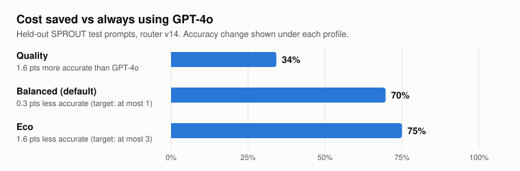
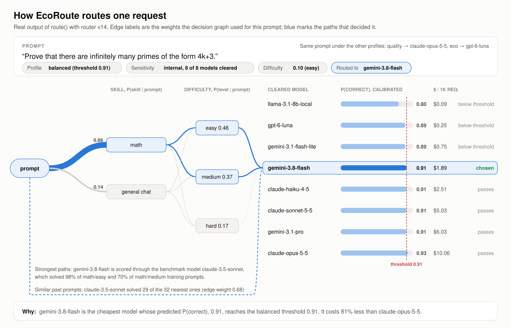
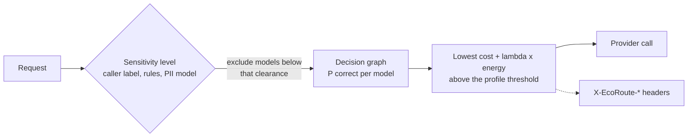

# EcoRoute

An LLM gateway that routes each request by predicted answer quality, cost and data
sensitivity.

**Status: research prototype.** The routing method and its evaluation are complete and
reproducible. The gateway has been tested end to end with a dry-run backend, but not
operated in production. It has no built-in authentication or rate limiting, so run it
behind an existing API gateway.

EcoRoute combines model selection with sensitivity-based routing. For each request it
takes three steps:

1. **Sensitivity.** It assigns a level (public, internal, confidential or restricted)
   and excludes every model whose configured clearance is below that level.
2. **Quality.** A weighted graph predicts, for each remaining model, the probability
   that it answers correctly.
3. **Cost.** Among the remaining models whose predicted probability reaches the
   selected profile's threshold, it takes the one with the lowest `cost + lambda *
   energy`. With `lambda = 0` (the `quality` profile) this is simply the cheapest. If no
   model reaches the threshold, it takes the most likely model, or the cheapest one
   within a small margin of it.

The response headers report the chosen model, the sensitivity level, the predicted
difficulty and the reason for the choice.

**Main result.** On 4,295 held-out SPROUT test prompts, the default profile cost 69.7% less
than always using GPT-4o. Its accuracy changed by -0.27 percentage points (90% CI -0.99
to +0.43). The [Results](#results) section gives the full results and their scope.



### One request, step by step

The figure below is one real routing decision by router v14. The prompt is a short
number-theory proof:

1. The privacy check finds nothing sensitive, so all 8 models stay in.
2. The graph reads the prompt as math (0.86) and mostly easy or medium.
3. Through those paths and the 32 most similar past prompts, it predicts each model's
   chance of a correct answer.
4. Under the default `balanced` profile, the cheapest model at or above the 0.91
   threshold wins: gemini-3.8-flash, 81% cheaper than claude-opus-5-5.

The same prompt goes to claude-opus-5-5 under `quality` and to gpt-6-luna under `eco`.



All numbers come from `scripts/decision_example.py` (eight prompts under each profile,
saved in [`reports/decisions_v14.json`](reports/decisions_v14.json)). The figure is
drawn from that file by `scripts/draw_decision.py`.

## How it works



### Sensitivity: what is enforced and what is detected

**Enforced: a fixed rule in the gateway.** Once a request has a sensitivity level, every
model whose `clearance` in `configs/models.yaml` is below that level is excluded:

- Price, predicted quality and the profile cannot add the model back.
- A caller who names an uncleared model directly gets a 403 refusal. Naming a cleared
  model works as usual.
- If no configured model is cleared, the request is refused and nothing is sent.

**Detected: statistical.** The level comes from three layers, and the strictest one wins:

- **Caller label.** The caller's own label, sent in `X-EcoRoute-Sensitivity`. An unknown
  label counts as confidential.
- **Rules.** Deterministic patterns for keys and tokens, private keys, connection
  strings, cards (Luhn check), IBANs, SSNs, labelled and long ID numbers, emails, phones
  and IP addresses.
- **PII model.** A
  [piiranha](https://huggingface.co/iiiorg/piiranha-v1-detect-personal-information) model
  that runs over the whole conversation.

Detection can miss. A text classified too low is routed by that lower level, so a missed
text can reach an external model. On the evaluation set (run 27):

| Measure | Result |
|---|---|
| Texts with restricted data (keys, account and ID numbers, cards, passwords) rated restricted | 99.0% |
| Texts with any personal data rated confidential or higher | 96.7% |
| Ordinary prompts flagged (false alarms) | 7.6% |

Use EcoRoute alongside existing DLP labels, not as a replacement.

### Quality and cost

The graph links each prompt to three things: skills (code, math, chat, ...), a
difficulty level, and its most similar training prompts. Each path ends at a model,
weighted by the share of such prompts that model answered correctly. The sum is
calibrated into P(correct).

Among the cleared models with P(correct) at or above the profile's threshold, EcoRoute
takes the one with the lowest `cost + lambda * energy`, where cost is the estimated USD
for the request and energy its estimated Wh. `lambda` is 0 for `quality` (cost alone),
$0.00025 per Wh for `balanced` and $0.0025 per Wh for `eco`.

If no model reaches the threshold, EcoRoute considers the most likely model and any
model within the profile's fallback margin of it, and takes the lowest `cost + lambda *
energy` among them. The margin is chosen on validation data and is 0 except for
`balanced` (0.02).

## Results

| | |
|---|---|
| Router | v14, evaluated at commit `1274b3b` |
| Test set | 4,295 SPROUT prompts in the test split (prompt-id hash, 10%) that every model answered |
| Reference | GPT-4o, the most accurate single model on validation (test accuracy 84.5%, $0.0048 per request) |
| Cost | SPROUT token counts priced with the per-token prices published with SPROUT; router overhead not included |
| Interval | 90% percentile bootstrap over test prompts (1,000 paired resamples) |
| Report | `python scripts/eval_router.py --router <router.pt>` writes [`reports/eval_router_graph_v14_sprout.json`](reports/eval_router_graph_v14_sprout.json) |

| Profile | Target (chosen on validation) | Accuracy change vs GPT-4o, percentage points (90% CI) | Cost saved |
|---|---|---|---|
| quality | no loss | +1.55 (+0.85 to +2.22) | 34.2% |
| balanced (default) | at most 1 point lower | -0.27 (-0.99 to +0.43) | 69.7% |
| eco | at most 3 points lower | -1.57 (-2.34 to -0.79) | 75.0% |

The profile targets are the criteria the thresholds were chosen to meet on validation
data. The test intervals show that they held on this test set. They are not guarantees
for other traffic: a different prompt mix or different models can shift both accuracy
and savings.

The [technical report](docs/report.md) has more results:

- **Coding prompts.** On 108 BigCodeBench test tasks, the router is 1.8 points below
  GPT-4o at 48% to 60% lower cost. Predicting which model solves a coding task is the
  weakest part (AUC 0.65).
- **Routing overhead.** A decision takes 74 ms median (p95 121 ms) on one NVIDIA T4,
  including the PII model.
- **End-to-end check.** `scripts/e2e_check.py` passes 16 of 16 checks through the HTTP
  gateway (run 37).
- **Ablations.** The report covers each design choice, including a leak in an earlier
  evaluation protocol that was found and fixed.

Projections to company volumes (yearly cost, energy, CO2) are estimates under stated
assumptions. See [docs/impact.md](docs/impact.md) for assumptions and projections.

## Getting started

### Requirements

- **Python** 3.10 or later.
- **A trained router file.** No pretrained checkpoint is published yet, so you train one
  first (next section).
- **For training:**
  - an NVIDIA GPU is recommended (the published runs used one 16 GB T4);
  - about 2 GB of disk for the data;
  - on first use, the encoder and the PII model download from Hugging Face.

```bash
git clone https://github.com/waliddoesthis/ecoroute.git
cd ecoroute
pip install -e ".[dev]"
pytest
```

### Train a router

```bash
python scripts/build_dataset.py --out data/processed          # about 2 GB download
python scripts/train_router.py --data data/processed --out artifacts/router.pt
python scripts/eval_router.py --router artifacts/router.pt --data data/processed
```

[docs/reproducing.md](docs/reproducing.md) covers every command and data source, and how
to run them on Lightning AI's free GPU tier. Training time has not been benchmarked
separately; all published runs completed on one T4.

### Try it without calling any model

```bash
python scripts/route_demo.py --router artifacts/router.pt          # decisions, explained
```

To run the gateway as a dry run, start it in one terminal. It keeps running until you
stop it:

```bash
python scripts/serve.py --router artifacts/router.pt --dry-run     # http://127.0.0.1:8080
```

With `--dry-run`, every enabled catalog model can be chosen, no API keys are needed, and
each answer names the model that would have been used. You can then send requests to it
from a second terminal.

The end-to-end check does not need that server: it starts its own in-process copy of the
gateway, so it can run on its own:

```bash
python scripts/e2e_check.py --router artifacts/router.pt           # PASS/FAIL per check
```

### Run the gateway

```bash
export OPENAI_API_KEY=... GEMINI_API_KEY=... ANTHROPIC_API_KEY=...   # only those you use
python scripts/serve.py --router artifacts/router.pt --port 8080 --pii-device 0
```

```python
from openai import OpenAI

client = OpenAI(base_url="http://localhost:8080/v1", api_key="unused")
r = client.chat.completions.with_raw_response.create(
    model="ecoroute/auto",
    messages=[{"role": "user", "content": "Summarise this ..."}],
    extra_headers={"X-EcoRoute-Policy": "balanced"},  # eco / balanced / quality
)
r.headers["X-EcoRoute-Model"], r.headers["X-EcoRoute-Reason"]
```

### Supported API

| Endpoint | Notes |
|---|---|
| `POST /v1/chat/completions` | OpenAI Chat Completions format, including `stream: true` |
| `GET /v1/models` | `ecoroute/auto` plus the models that can be routed to |
| `POST /route` | The decision and its explanation, without calling any model |

Other OpenAI endpoints (legacy Completions, Embeddings, Responses) are not implemented.

**How requests reach providers.** EcoRoute has no provider-specific adapters. Every
provider in `configs/providers.yaml` must expose an OpenAI-compatible
`/chat/completions` endpoint, for example OpenAI itself, Google's and Anthropic's
OpenAI-compatible endpoints, vLLM or Ollama. EcoRoute posts the request body as
received, replacing only `model` with the chosen model's `api_id`. It does not translate
or validate other parameters. Whether a parameter such as `tools`, `response_format` or
`logprobs` works therefore depends on that provider's OpenAI compatibility, and a
parameter the provider rejects returns as a provider error. `max_tokens` (or
`max_completion_tokens`) is also read to estimate the request's cost.

| Request header | Effect |
|---|---|
| `X-EcoRoute-Policy` | `eco`, `balanced` (default) or `quality` |
| `X-EcoRoute-Sensitivity` | The caller's data label, e.g. `Confidential` |
| `X-EcoRoute-Min-Level` | A minimum sensitivity level for the request |

Response headers: `X-EcoRoute-Model`, `-Level`, `-Difficulty`, `-Reason` and `-Time-Ms`.

- **Which models can be chosen:** models need an `api_id` in `configs/models.yaml` and
  their provider's API key set. Self-hosted models (vLLM, Ollama) are configured in
  `configs/providers.yaml`.
- **Naming a model:** asking for a specific model instead of `ecoroute/auto` skips the
  quality ranking. The clearance rule still applies: an uncleared model returns 403, and
  an unknown model returns 404.
- **Provider failures:** for non-streaming requests, if the chosen provider fails, the
  gateway retries once, on the most likely other model cleared for the same level.
  Streaming requests are not retried.

### Running without the PII model

`--no-pii-model` disables the PII model. Sensitivity detection then relies on caller
labels and deterministic rules.

- **Rules remain active for** structured patterns such as keys, cards, IBANs, SSNs, ID
  numbers, emails and phones. Like any pattern matching, they can miss values in
  unexpected formats.
- **No longer detected:** names, addresses and other personal data in free text. Such
  requests may be classified as internal and sent to external models.
- **When to use it:** only when callers label sensitive data themselves, or for testing.
- **Speed:** without the model, routing took about 33 ms median in the end-to-end check
  (run 37).

## Limitations

- **Benchmark data.** Savings are measured on public benchmark prompts and published
  prices. A company's own savings depend on its prompt mix. The intended next step is to
  fit the deployed models on internally graded answers
  ([integration guide](docs/enterprise-integration.md#6-rollout)).
- **Deployed models.** The newer models in the catalog are scored through benchmark
  anchors, not graded directly.
- **Coding prompts.** Predicting which model solves a coding task is weak (AUC 0.65).
- **Energy.** Energy figures for API models are order-of-magnitude priors, because
  providers don't publish per-model numbers.
- **Detection.** Sensitivity detection is statistical (see above). The clearance rule is
  only as good as the level it receives.
- **No production features.** There is no built-in authentication, rate limiting or
  persistent audit log.

## Documentation

| Document | Contents |
|---|---|
| [Technical report](docs/report.md) | Method, datasets, protocol, results with intervals, ablations |
| [How it decides](docs/how-it-decides.md) | Design and routing decisions |
| [Reproducing](docs/reproducing.md) | Commands, data, hardware and all measurement scripts |
| [Integration guide](docs/enterprise-integration.md) | Where it fits in a company's stack, compliance support, rollout |
| [Impact estimates](docs/impact.md) | Cost, energy and CO2 projections, with their assumptions |

## Repository layout

```
configs/      models.yaml (catalog: price, energy, clearance), providers.yaml (endpoints)
src/ecoroute/
  confidentiality/  levels, rules, PII model layer, caller policy, redaction
  graph/            the decision graph (skills, difficulty, similar prompts)
  predictors/       baselines, calibration, catalog anchoring
  routing/          profiles and the decision with its explanation
  gateway/          OpenAI-compatible FastAPI app and provider backends
  data/, eval/      dataset loaders and routing metrics
  service.py        EcoRoute: embed, predict, decide (save/load the router file)
scripts/      build, train, evaluate, serve
docs/         report, design, reproducing, integration, impact
reports/      saved evaluation reports behind the published numbers
```

## License

[MIT](LICENSE).

## Citation

```bibtex
@software{ecoroute2026,
  author = {Ichchou, Walid},
  title  = {EcoRoute: An LLM Gateway Routing by Predicted Quality, Cost and Data Sensitivity},
  year   = {2026},
  url    = {https://github.com/waliddoesthis/ecoroute}
}
```
