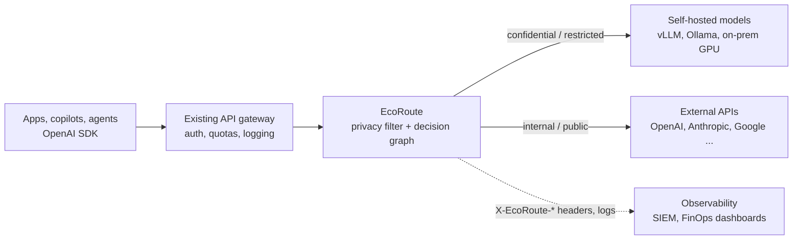

# Integrating EcoRoute in an enterprise

This guide is for platform, security and FinOps teams. It covers where EcoRoute sits in a
company's AI stack, which existing controls it plugs into, and how to roll it out without
disrupting the teams that already call LLMs.

## 1. Where it sits

Most large companies already route LLM traffic through one internal endpoint. That
endpoint might be an API gateway (Kong, Apigee, Azure API Management), an LLM proxy
(LiteLLM, Portkey) or a platform team's own service. EcoRoute is one more hop on that
path: an OpenAI-compatible service that decides which model each request goes to.

Apps keep their OpenAI client and change two values: `base_url` points at EcoRoute, and
the model becomes `ecoroute/auto`. Nothing else in the application changes.

## 2. Integration patterns

| Pattern | When to use it | What changes |
|---|---|---|
| **Drop-in proxy** | Teams call the OpenAI API directly | `base_url` and `model="ecoroute/auto"` |
| **Behind the API gateway** | Auth, quotas and audit already live in a gateway | Add EcoRoute as the gateway's LLM upstream |
| **In front of an LLM proxy** | Provider keys, retries and budgets live in LiteLLM or similar | Point EcoRoute's providers at the proxy's OpenAI-compatible URL in `configs/providers.yaml` |
| **Decision only** | An orchestrator or agent framework calls models itself | Call `POST /route` for the decision and explanation, then call the model as usual |
| **Pinned model** | A workload must use one model (evaluation, regulated output) | Name the model instead of `ecoroute/auto`; the privacy check still applies |

`POST /route` calls no model, so it also suits a shadow phase (section 6).

## 3. Compliance and data protection

Two parts need to be told apart:

- **Enforced:** once a request has a sensitivity level, models whose clearance is below
  it are excluded before any cost or quality trade-off. Price cannot add them back. A
  request that no configured model is cleared for is refused (403) and not sent.
- **Detected:** the level itself comes from caller labels, rules and a PII model, and
  detection can miss. A request classified too low is routed by that lower level.

| Requirement | How EcoRoute supports it |
|---|---|
| **Data minimisation (GDPR Art. 5(1)(c))** | Personal data detected anywhere in the conversation restricts the request to models cleared for it. `redact()` / `restore()` can mask values when a task does not need them. |
| **Data residency and vendor contracts** | Each model has a `clearance` in `configs/models.yaml`. Raise an external model to `confidential` only when a DPA or zero-data-retention contract covers it. |
| **Existing classification (DLP)** | Labels from Microsoft Purview, Google DLP or in-house schemes pass through `X-EcoRoute-Sensitivity`. The strictest of the caller's label and EcoRoute's own detection wins. |
| **Secrets in prompts** | Detected API keys, tokens, private keys and connection strings make the request restricted, so it goes only to models cleared for restricted data (self-hosted in the default catalog). Matched values are not written to headers, logs or explanations. |
| **Auditability** | Every response states the level found, the reason and the model chosen (`X-EcoRoute-Level`, `-Reason`, `-Model`). |

Measured detection (run 27): 99.0% of texts with restricted data were rated restricted,
96.7% of texts with any personal data were rated confidential or higher, and 7.6% of
ordinary prompts were flagged. Detection
favours recall: a false alarm only keeps a prompt on a self-hosted model, while a miss
would leak it. EcoRoute is a technical control that supports compliance; it does not
replace a data-protection assessment.

## 4. Deployment

- **Where it runs.** EcoRoute is a stateless FastAPI service, so it runs in the company's
  VPC or on-prem and scales horizontally. The router file, encoder and PII model load at
  start-up. No prompt is stored.
- **Hardware.** A routing decision takes about 74 ms median (p95 121 ms) on one NVIDIA T4,
  including the PII model. Without a GPU, `--no-pii-model` keeps the rule layer (keys,
  cards, IBANs, IDs, emails, phones) at about 33 ms. LLM calls themselves take seconds.
- **Self-hosted models.** Confidential and restricted traffic needs at least one model
  cleared for it. Any OpenAI-compatible server works (vLLM, Ollama, TGI). Their cost is
  priced from GPU power and hourly hardware cost (`hosting` in the catalog), so they are
  never treated as free.
- **Resilience.** If the chosen provider fails, the gateway retries on the most likely
  other model cleared for the same level, never on an uncleared one.
- **Dry run.** `scripts/serve.py --dry-run` calls no provider. `scripts/e2e_check.py`
  checks a deployment end to end before any traffic or API key is involved.

## 5. Observability and FinOps

Every response carries:

| Header | Content |
|---|---|
| `X-EcoRoute-Model` | the model that answered |
| `X-EcoRoute-Level` | public / internal / confidential / restricted |
| `X-EcoRoute-Difficulty` | predicted difficulty, 0 to 1, with a label |
| `X-EcoRoute-Reason` | the decisive step in plain language |
| `X-EcoRoute-Time-Ms` | routing time per stage |

Shipping these headers, or the gateway's log line, to an existing SIEM or FinOps
dashboard gives cost per team, model mix, share of sensitive traffic and routing latency.
No new monitoring stack is needed.

## 6. Rollout

1. **Shadow.** Send a copy of production prompts to `POST /route` and compare its
   choices with what teams use today. No user-facing change.
2. **Catalog and clearances.** Security sets each model's `clearance` from existing vendor
   contracts. Platform sets prices and the self-hosted hardware.
3. **Calibrate.** Grade a few hundred answers per deployed model on internal tasks, then
   fit each model's shift with `CatalogPredictor.fit_shift()`. Until then, deployed models
   are scored through benchmark anchors.
4. **Canary.** Route a small share of one team's traffic through EcoRoute. Watch accuracy
   (thumbs-up rates or evaluation sets), cost and latency.
5. **Expand by team, with a profile per team** (section 7).
6. **Review quarterly.** Refresh prices and add new models; adding a model needs only a
   catalog entry and an anchor, not retraining.

## 7. Choosing a profile per team

| Profile | Accuracy target vs the best model | Measured saving | Typical teams |
|---|---|---|---|
| `quality` | no loss | 34% | Legal drafting, customer-facing answers, code that ships |
| `balanced` (default) | at most 1 point | 70% | Internal assistants, analytics, knowledge search |
| `eco` | at most 3 points | 75% | Summaries, classification, batch enrichment, drafts |

A team sets its default profile in the gateway, and a request can override it with
`X-EcoRoute-Policy`.

## 8. Risks and mitigations

| Risk | Mitigation |
|---|---|
| A sensitive value is missed (detection is statistical) | Layered detection (caller labels, rules, PII model), recall-first thresholds, and labels from existing DLP |
| The router is wrong for a company's own tasks | Fit model shifts on internal graded answers. Profiles are measured targets with confidence intervals, not promises |
| Coding prompts | Predicting which model solves a coding task is the weakest part (AUC 0.65). Teams that need certainty can use `quality` or pin a model |
| Prices and models change | The catalog is configuration: update prices or add a model without retraining |
| Added latency | About 74 ms median on a T4, small next to LLM response times |
